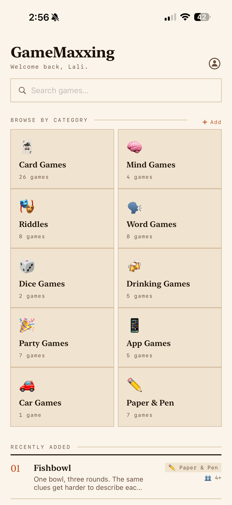
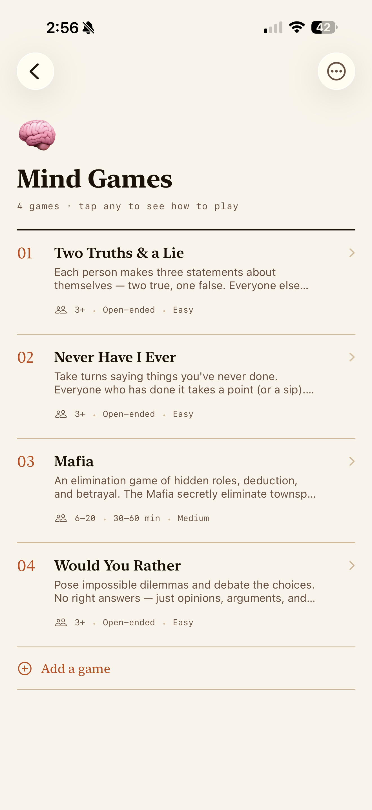
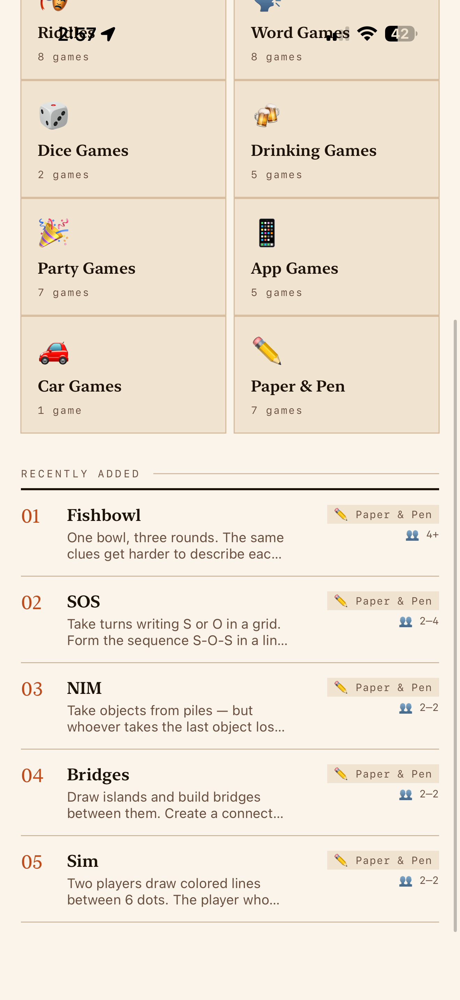
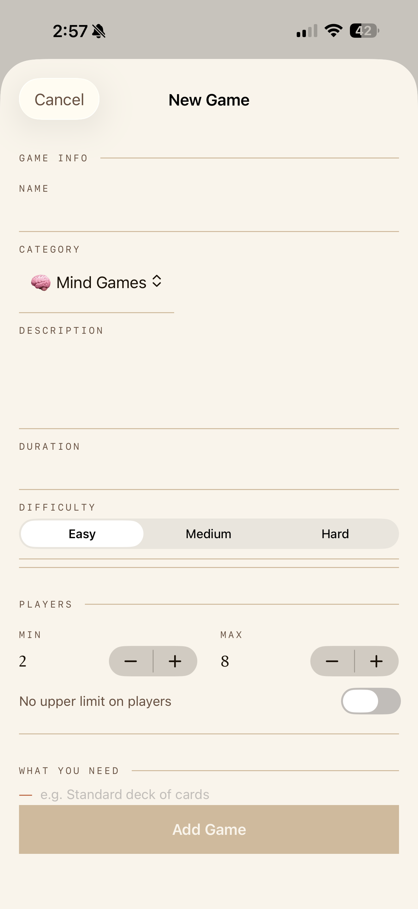
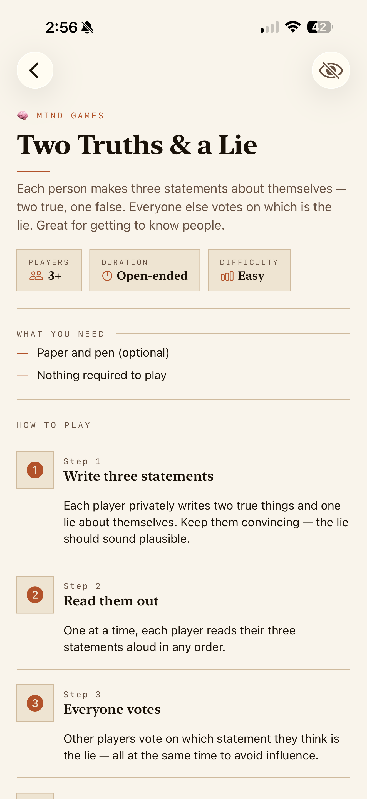

# GameMaxxing

A retro-styled iOS app for discovering, learning, and organizing games — from card games and riddles to drinking games and party games. Never forget how to play a game again.

## Screenshots

  
  
  
  
  

## Features

- **Browse by category** — Card Games, Mind Games, Riddles, Word Games, Drinking Games, Party Games, and more
- **Full how-to-play instructions** — Step-by-step rules for every game
- **Library & My Games tabs** — Separate built-in games from ones you've added yourself
- **Add custom games** — Create your own games with players, duration, difficulty, and steps
- **Swipe to delete** — Remove or hide any game with a swipe
- **Search** — Find any game instantly
- **Recently Added** — Quick access to the latest games on the home screen

## Tech Stack

- SwiftUI
- Swift 5
- iOS 17+
- `@Observable` macro for state management
- `UserDefaults` for persistence

## Getting Started

1. Clone the repo
2. Open `gameMaxxing/gameMaxxing.xcodeproj` in Xcode
3. Run on a simulator or device (iOS 17+)
